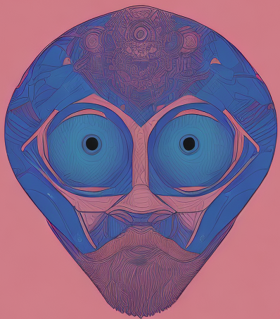

<p align="center" text-align="center">
  
</p>

<div align="center">
  <h1>selfdiffusion</h1>
</div>

<p align="center">
  <a href="https://opensource.org/licenses/MIT"></a>
  <a href="https://pypi.org/project/selfdiffusion/"></a>
  <a href="https://pypi.org/project/selfdiffusion/"></a>
</p>


selfdiffusion is a CLI tool that helps you prepare training datasets of 
*portrait* images for 
[stable diffusion](https://en.wikipedia.org/wiki/Stable_Diffusion) model
fine tuning.  

selfdiffusion takes as input images of different sizes and uses an empirical
heuristic to extract the subject of the image and create a version of it that 
fits the native resolution of the model you want to fine-tune.

## Getting started
install the CLI tool with pip:
```bash
pip install selfdiffusion
```

## Usage
Start by assembling a set of images that contains the single subject you want
to fine tune the model on. If you don't have such a
dataset, we provide the utiliy bing command to download images from the internet into a target folder:

```bash
selfdiffusion bing "portrait of a person" --target /path/to/target/folder --limit 20
```

this will download 20 images of people from bing and store them in the /path/to/target/folder.

Once you have your starting images, extract portraits suitable for fine tuning with the following command:

```bash
# 512x512 is ideal for fine-tuning runwayml/stable-diffusion-v1-5
selfdiffusion person /path/to/input/images /path/to/output/images --resolution 512 512
```

you can find out more about model fine tuning in the exemples folder of the [diffusers](https://github.com/huggingface/diffusers) repository. 

### Notes
selfdiffusion will produce an output image for every input image given that:

1. The input image as a resolution that is greater then the requested output resolution in both dimensions.

2. There is a single person in your image, as determined by [yolov8](https://github.com/ultralytics/ultralytics)
and it's face is the only one in the image, as determined by [face_recognition](https://github.com/ageitgey/face_recognition).

Sometimes, selfdiffusion will filter out an image that very evidently
contains a single subject and it's face. If you absolutely want to have this image in your dataset, we suggest using a tool like [Birme](https://www.birme.net) for capturing the subject and resizing to the native model resolution.

## Author
Jonathan Pelletier.


